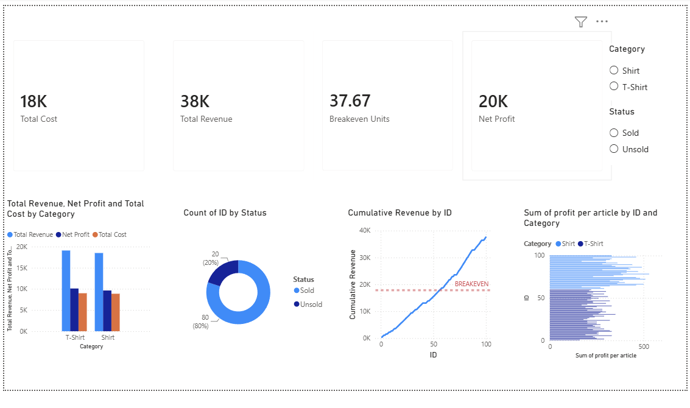

# 📊 Drippy But Broke - Sales Performance Dashboard

An interactive **Power BI dashboard** built to analyze sales performance, profitability, and business metrics for the **Drippy But Broke** apparel brand. The dashboard enables users to monitor revenue, costs, profit, product performance, and sales status through dynamic visualizations and interactive slicers.

---

## 📷 Dashboard Preview



---

## 🎯 Project Overview

This project demonstrates end-to-end Business Intelligence development using **Power BI**, **DAX**, and **Microsoft Excel**. Raw sales data was transformed into an interactive dashboard to provide meaningful business insights and support data-driven decision-making.

The dashboard answers key business questions such as:

- What is the total revenue generated?
- How much net profit has been earned?
- Which product category performs better?
- What percentage of products are sold vs. unsold?
- When does cumulative revenue cross the break-even point?
- Which products generate the highest profit margins?

---

## 🛠️ Tech Stack

- Power BI
- DAX (Data Analysis Expressions)
- Microsoft Excel
- Data Visualization
- Business Intelligence

---

## 📁 Repository Structure

```
drippy_but_broke/
│── drippy_but_broke_dashboard.pbix
│── image.png
│── Drippy_But_Broke_PowerBI_Source.xlsx
│── README.md
```

---

## 📈 Dashboard Features

### KPI Cards
- Total Cost
- Total Revenue
- Net Profit
- Breakeven Units

### Visualizations
- Revenue vs Cost vs Profit by Category
- Sales Status Distribution (Donut Chart)
- Cumulative Revenue (Break-even Analysis)
- Product-wise Profit Distribution

### Interactive Filters
- Category
- Status

---

## 📊 DAX Measures Used

- Total Cost
- Total Revenue
- Net Profit
- Return on Cost %
- Units Sold
- Sell-Through %
- Average Selling Price
- Breakeven Units

---

## 📌 Key Business Insights

- Total Revenue: **₹38K**
- Net Profit: **₹20K**
- Total Cost: **₹18K**
- Approximately **80%** of products were successfully sold.
- The cumulative revenue trend clearly indicates the point at which the business reaches break-even.
- Category-wise analysis highlights the profitability differences between product segments.

---

## 🚀 How to Use

1. Clone or download this repository.
2. Open `drippy_but_broke_dashboard.pbix` in **Power BI Desktop**.
3. Explore the dashboard using the **Category** and **Status** slicers.
4. Interact with the visuals to analyze sales performance and profitability.

---

## 💼 Skills Demonstrated

- Business Intelligence
- Data Visualization
- Dashboard Development
- DAX Calculations
- KPI Development
- Sales Analytics
- Business Analysis
- Interactive Reporting
- Microsoft Excel
- Power BI

---

## 👨‍💻 Author

**Rupanshu Kaim**

- GitHub: https://github.com/rupanshu7385kaim-hub
- LinkedIn: *(Add your LinkedIn profile link here)*

---

⭐ If you found this project useful, feel free to star the repository.
